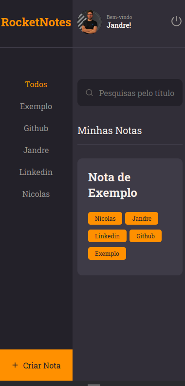

<h1 align="center">RocketNotes Frontend</h1>

Este é o repositório do frontend da aplicação RocketNotes, desenvolvido com o uso de tecnologias de ponta para garantir uma experiência de usuário moderna e responsiva em dispositivos móveis.

<h2 align="center">Ferramentas Utilizadas</h2>
<ul>
<li>React</li>
<li>Styled Components</li>
<li>Rotas Dinâmicas, que permitem ao usuário navegar pelo aplicativo de forma intuitiva e eficiente, mesmo quando não autenticado</li>
<li>Context, para compartilhar informações importantes entre diferentes componentes da aplicação</li>
<li>LocalStorage, que permite armazenar o token de autenticação do usuário de forma segura e eficiente</li>
</ul>

<h2 align="center">Responsividade para Mobile</h2>

A RocketNotes é uma aplicação altamente responsiva e otimizada para uso em dispositivos móveis, garantindo uma experiência de usuário intuitiva e agradável em telas de qualquer tamanho. O layout bem estruturado e as funcionalidades cuidadosamente planejadas tornam a RocketNotes uma ferramenta eficiente para gerenciamento de notas em qualquer lugar.

</img>
</img>
</img>

<h2 align="center">Layout widescreen:</h2>

</img>
</img>
</img>
